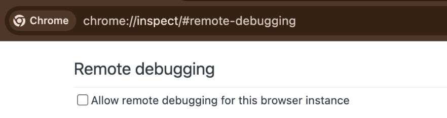

# Wine View 🍷

> Fork of [browser-use/browser-harness](https://github.com/browser-use/browser-harness) (MIT, © Browser Use), renamed to wine-view. Telemetry and the PyPI update check are removed: it sends nothing anywhere except the sites you drive and, only if you opt in with an API key, Browser Use Cloud.

Connect an LLM directly to your real browser through one editable CDP websocket. The agent writes missing helpers as it works, so the harness improves with every task.

Paste the setup prompt into your coding agent.

```
  ● agent: wants to upload a file
  │
  ● agent-workspace/agent_helpers.py → helper missing
  │
  ● agent writes it                         agent_helpers.py
  │                                                       + custom helper
  ✓ file uploaded
```

**You will never use the browser again.**


## What's different in this fork

wine-view is [browser-use/browser-harness](https://github.com/browser-use/browser-harness) 0.1.13 (MIT, © Browser Use), renamed and made private-by-default:

| Change | Upstream | wine-view |
|---|---|---|
| CLI | `browser-harness`, `browser-harness-mcp` | `wine-view`, `wine-view-mcp` |
| Python package | `browser_harness` | `wine_view` |
| Config dir | `~/.config/browser-harness` | `~/.config/wine-view` |
| Env vars | `BH_*`, `BU_*`, `BROWSER_HARNESS_*`, `BROWSER_USE_*` | `WV_*`, `WINE_VIEW_*` |
| Runtime files | `bu-<name>.sock/.pid/.log` | `wv-<name>.sock/.pid/.log` |
| Tab marker | 🐴 | 🍷 |
| Telemetry | PostHog events on every command (opt-out) | **removed** (`telemetry.py` is a no-op stub) |
| Update check | daily PyPI version check | **removed**; update with `git pull` |
| First attach on local Chrome | attaches to your first open tab (slow if it is a busy background tab) | opens/reuses its own blank background tab — never touches your tabs (fresh start ~13s → ~1.9s) |
| Chrome "Allow remote debugging?" prompt | click Allow or run `mac-approve` | optional auto-allow: set `WV_AUTO_APPROVE=1` (macOS, needs Accessibility permission for your terminal) |

Nothing is sent anywhere except the sites you drive, plus Browser Use Cloud only if you set `WINE_VIEW_API_KEY`.

### Install

```bash
git clone https://github.com/Bibin-VR/wine-view.git ~/Developer/wine-view
uv tool install --python 3.12 -e ~/Developer/wine-view
ln -s ~/Developer/wine-view/skills/wine-view ~/.claude/skills/wine-view   # Claude Code skill
```

Then enable remote debugging at `chrome://inspect/#remote-debugging`. To stop auto-allowing, unset `WV_AUTO_APPROVE`; to cut access entirely, turn remote debugging off.

### Syncing with upstream

```bash
git fetch upstream && git merge upstream/main   # then re-apply the rename to new text, run `pytest tests/unit`, and check no telemetry/update calls came back
```

## See it work

**Task:** "Open my X profile, find my latest 20 video posts, and download them."

[](https://browser-use.com/showcase/videos/download-latest-20-x-videos.mp4)

## Setup prompt

Paste into Claude Code or Codex:

```text
Install or upgrade wine-view to the latest stable version with uv using Python 3.12, register the skill from `wine-view skill`, and connect it to my browser. Ask whether I want local browser recordings enabled; default to no and preserve my existing preference on upgrades. Follow https://github.com/Bibin-VR/wine-view/blob/main/install.md if setup or connection fails.
```

The agent will open `chrome://inspect/#remote-debugging`. On first setup, tick
the checkbox so the agent can connect to your browser:



## How it works

- [`install.md`](install.md) connects the agent to your browser.
- [`SKILL.md`](SKILL.md) teaches it the browser workflow.
- [`src/wine_view/`](src/wine_view/) stays protected while the agent writes reusable helpers in its local workspace.

## Scale with Browser Use Cloud

Use your local browser for logged-in, personal work. When you want many browsers in parallel—with live previews, proxies, stealth, CAPTCHA solving, and more—scale with [Browser Use Cloud](https://cloud.browser-use.com/new-api-key).

## MCP server

`wine-view-mcp` exposes the browser control helpers as MCP tools over
stdio, so any MCP client (Claude Code, Devin, Cursor, etc.) can drive the
browser without writing a second CDP layer. See [docs/MCP.md](docs/MCP.md) for
setup and client configuration.

## Contributing

Bug fixes, documentation improvements, and agent-generated domain skills are welcome. See [CONTRIBUTING.md](CONTRIBUTING.md).

---

[The Bitter Lesson of Agent Harnesses](https://browser-use.com/posts/bitter-lesson-agent-harnesses) · [Web Agents That Actually Learn](https://browser-use.com/posts/web-agents-that-actually-learn)
